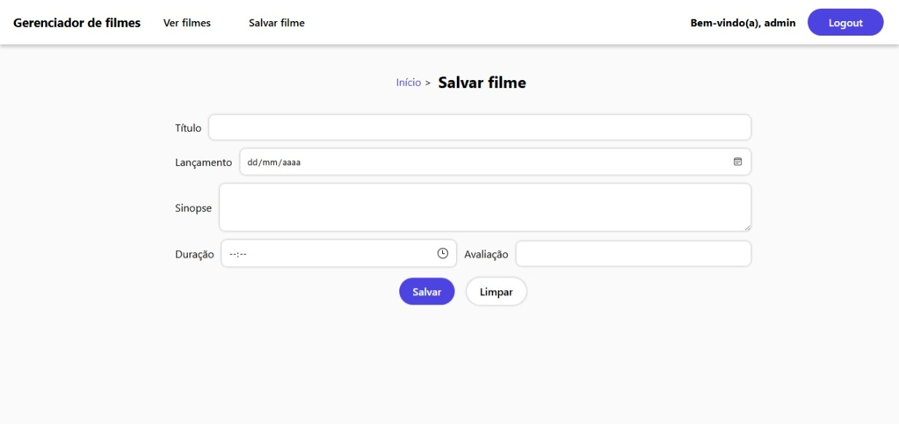

# Sistema de cadastro e gerenciamento de filmes

## Funcionalidades

O sistema permite que usuários se cadastrem, façam login e gerenciem sua própria lista de filmes. Após o login, é possível adicionar, listar, editar, e excluir filmes.

## Usuário/senha de teste

- Usuário: admin
- E-mail: admin@admin.com
- Senha: admin

## Instalação do banco

- Importe o script `/sql/cinema.sql` para criar o banco de dados com as tabelas de filmes e usuários. Talvez seja necessário alterar a porta de conexão do servidor MySQL dependendo de suas configurações.
